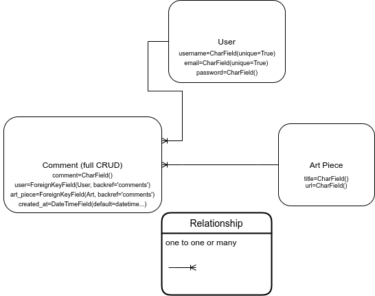

# G's Canvas

### An art website where users may view and comment on various art pieces

## Wireframes

## Component Hierarchy

## ERD (Entity Relationship Diagram)

 

### MVP 

- Create React/Flask/PSQL application and deploy via Heroku and Netlify
- Application will have full front-end and back-end CRUD functionality
- Application will have tables for both User, Comment, Art
- Application will utilize credentials 
- Render application in browser
- The G's Canvas repo has a README.md that documents the project in detail

### PostMVP  

- Add Cloudinary API for image uploads
- Add Likes
- Additional styling/animations
- Add footer

## Timeframes

| Component | Priority | Estimated Time | Actual Time| 
| --- | :---: |  :---: | :---: | 
| Planning | H | 3hrs| 3hrs | 
| ERD/wireframes | H | 3hrs| 3hrs |
| Backend setup/ DB connect | H | 3hrs| 0hrs |
| models/schemas | H | 2hrs| 0hrs |
| Server setup | H | 2hrs| 0hrs |
| Controllers | H | 2hrs| 0hrs |
| Routes | H | 3hrs| 0hrs |
| Implement auth| H | 2hrs| 0hrs |
| Test all CRUD | H | 2hrs| 0hrs |
| React structure set-up | H | 2hrs| 0hrs |
| Screen Layout | H | 2hrs| 0hrs |
| Axios | H | 2hrs| 0hrs |
| User registration form | H | 3hrs| 0hrs |
| New post form | H | 3hrs| 0hrs |
| Nav/ login form | H | 3hrs| 0hrs |
| Render Art | H | 3hrs| 0hrs |
| Render comments | H | 2hrs| 0hrs |
| Post update/delete | H | 3hrs| 0hrs |
| Add common styling | H | 3hrs| 0hrs |
| Responsiveness | H | 3hrs| 0hrs |
| Animations/styling | H | 3hrs| 0hrs |
| Like button | H | 3hrs| 0hrs |
| Total | H | 51hrs| 0hrs | 

## SWOT Analysis

#### Strengths: Backend, Schemas, Routing

#### Weaknesses: Rendering images stored in backend

#### Opportunities: Learn working with  3rd party hosting 

#### Threats: Time management, leveraging help